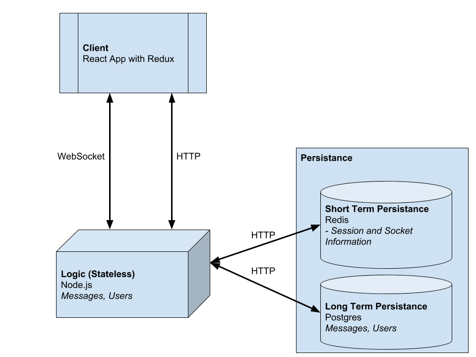

## System dependencies

#### Node

- install [Node](nodejs.org), preferably using a version manager such as [nvm](https://github.com/creationix/nvm)

#### Docker and docker-compose

- [docker-compose](https://github.com/docker/compose/releases): instructions are here
- [docker](https://store.docker.com/search?type=edition&offering=community): Download for your OS here


## Database setup

- Use the following command to seed your database

```
node server/models --seed
```
- You can also use the above command to completely reset the database at any time

## Running the project

Run this command then when the containers start up exit them

Then open a bash terminal and type

```
npm run-script runandbuild
```

Then go to 

```
localhost:8000 
```

in your browser

# Running with Hot Reloading for Dev

Run each of these in separate terminals

- From **root** folder run `npm run dev`
- From **root** folder run `docker-compose up`
- From **client** folder run `npm start`

# Design and Architecture
- Built with React.js, Redux, Material UI, Redis, Postgres, docker, docker-compose, node and express

## Architecture


## Tim and Eric
- [](https://www.youtube.com/watch?v=KweD1Bxjt9w)
